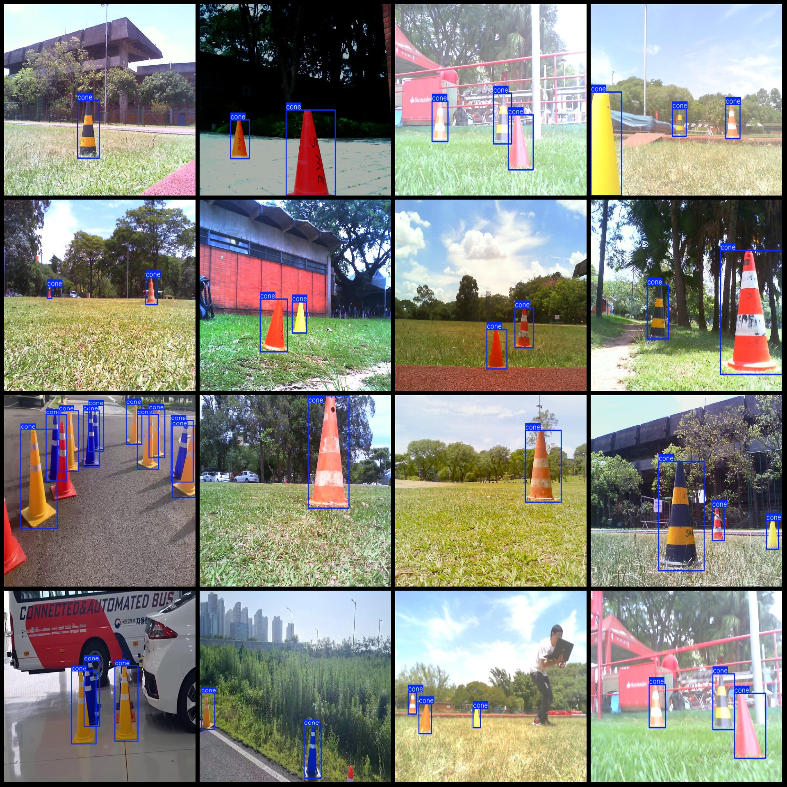
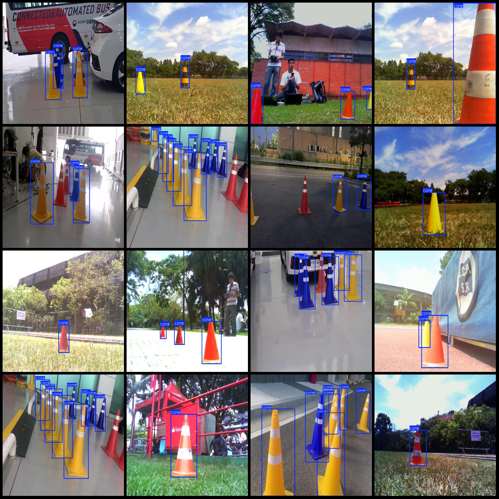

# Smart Traffic Road Signs Reflective Cone Detection Dataset: VOC+YOLO Format with 6467 Images in 1 Category

Dataset format: Pascal VOC format + YOLO format (without split path txt files, only including jpg images and corresponding VOC format xml files and YOLO format txt files)
Number of images (jpg file count): 6467
Number of annotations (xml file count): 6467
Number of annotations (txt file count): 6467
Number of annotation categories: 1
Annotation category name: ["cone"]
Number of bounding boxes per category:
- cone bounding box count = 18416
Total bounding boxes: 18416
Number of images per category:
- cone images count = 6467
Image resolution: 640x480
Annotation tool used: labelImg
Annotation rules: draw a rectangle around the category
Important note: The dataset does not include training, validation, or test sets; you will need to divide them yourself.
Special declaration: This dataset does not guarantee the accuracy of models or weight files trained on it.
Image preview:
Annotation example:

## Images

Here is a pay link on Stripe ( https://buy.stripe.com/3cs8yP7sY87d0vu9AB ). Please contact me lonlonago@foxmail.com after funding $89, and I will send you a complete data files , thank you!

